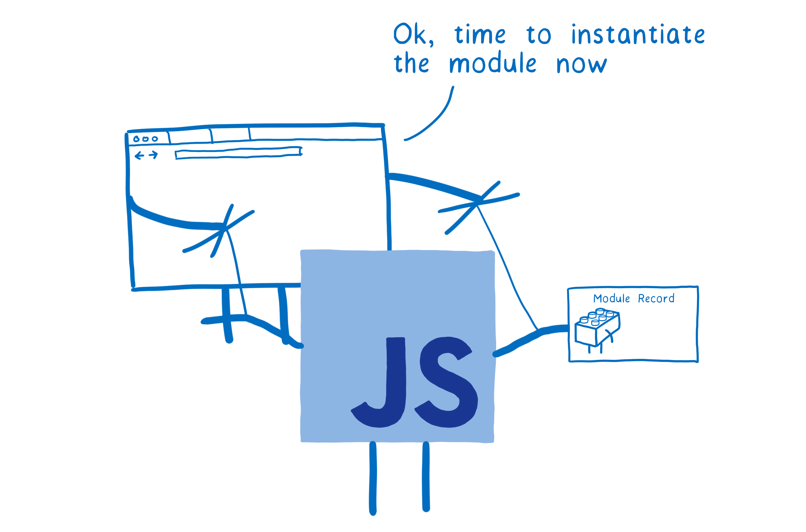
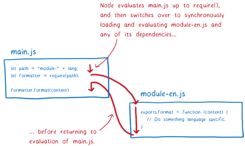

# Module
创建时间：2022-03-04

[ES modules: A cartoon deep-dive](https://hacks.mozilla.org/2018/03/es-modules-a-cartoon-deep-dive/)
## EMS 和 CJS
CJS(CommonJS): Node.js 使用的模块系统(旧)
ESM(EcmaScript Modules): JS 规范中的模块系统(新)

## 不同点
#### 文件加载方式不同: ES Module 异步加载, CJS 同步加载
- 浏览器通过 URL 加载文件。
    > 如果 ESM 是同步加载的话: 解析文件之前不知道需要获取哪些依赖, 获取文件之前无法解析;  
    这就意味着我们需要逐层遍历, 解析一个文件找到它的依赖关系然后加载这些依赖, 这会阻塞主线程。  
    这是 ESM 将算法拆分为多个阶段的原因之一。  
    将 **Construction** 阶段拆分成浏览器自己的阶段, 允许浏览器在 ESM 实例化同步操作之前获取文件, 并构建自己的 模块图, 然后进行解析, 实例化等操作。浏览器的文件加载器可以通过 ES module methods ( ParseModule, Module.Instantiate, and Module.Evaluate ) 精准控制 modules 加载方式。
    
- Node 通过文件系统直接获取文件。
    > CJS 从文件系统加载文件所需的时间远远小于通过 URL 下载。  
所以 Node 可以在加载文件时阻塞主线程。这就意味着在返回一个模块实例之前, 会遍历树、loading、instantiating、evaluation。

### 算法执行阶段不同
- CJS 只有一个阶段: Module loaded, instantiated, evaluated。  

- ESM 分多个阶段: 将 Construction 阶段分离, 从而允许浏览器能够在实例化之前获取文件并建立 Module Graph。
    > - Construction: Find, download, parse all of files into **Module Records** (查找, 下载并解析文件).
    >   > - Figure out where to download the file containing the module from (aka module resolution).
    >   > - Fetch the file (by downloading it from a URL or loading it from the file system).
    >   > - Parse the file into a **Module Record**.
    > - Instantiation: Find boxes of memory to place all of the exported values in (but don't fill them in with values yet). Then make both exports and imports point to those boxes in memory. This is called linking (为 exported 的变量分配内存, 但不赋值).
    > - Evaluation: Run the code to fill in the boxes with the variables's actual values (执行代码并将变量赋值).

### ESM import 中不能有变量
- CJS 执行只有一个阶段, 获取下一个 Module 之前已经执行本模块的代码, 即变量有值, 所以 Node 可以这样引入:
```javascript
require(`${path}/counter.js`);
```
- ESM 提前建立 Module Graph, 此时还未执行 **Evaluation**, 即此时变量没有值, 所以不能这样引入:
```javascript
import { count } from `${path}/counter.js`;
```
- ESM 可以通过 import() 动态导入。通过 import() 动态导入的文件作为 entry point 建立单独的 Module Graph, 所以 ESM 可以这样引入:
```javascript
import(`${path}/counter.js`);
```

### 导入内容不同
- ESM 导入导出都是指向内存同一个位置, 所以导出模块 export 之后更改本模块的变量, 导入模块可以看到更改。
- CJS 是导出时进行对整个导出对象进行复制, 所以导出模块在 exports 之后更改本模块的变量, 导入模块不会看到更改。

### 循环引入不同
#### ESM 循环引入  
- counter.js 同步访问 import 模块中的变量会报错;
- counter.js 异步能够正常访问 import 模块中的变量。

main.js
```javascript
import counter from './counter.js';

console.info(counter.count);  // 5

export const message = 'main.js complete';
```

counter.js
```javascript
import * as main from "./main.js";
import { message } from "./main.js";
 
// console.info(message);  // ReferenceError: Cannot access 'main' before initialization
// console.info(main.message);  // ReferenceError: Cannot access 'main' before initialization
setTimeout(() => {
  console.info(message);  // main.js complete
  console.info(main.message);  // main.js complete
});

export default {
  count: 5
};
```

#### CJS 循环引入
- counter.js 同步访问 exports 出的变量: undefined;  
- counter.js 异步访问 exports 出的变量: undefined | 正常值。  

> 执行 counter.js 时, main.js 的 **Evaluation** 还未执行完毕, 所以 require('main.js') 返回 {}, message 为 undefined。  
> 对于 message = require('main.js').message; JS 引擎在内存中为局部变量分配空间, 并将值设置为 undefined。  
> 异步访问变量, 此时已经可以获取到 main.js exports 的值, 所以 main.message 能够正常访问;  
> 但是两者并没有关联, 此时 counter.js 中的 message 指向的还是内存中的 undefined。

main.js
```javascript
let count = require('./counter.js').count;
console.info(count);  // 5

exports.message = 'main.js complete';
```
counter.js
```javascript
let main = require('./main.js');
let message = require('./main.js').message;

console.info(message);  // undefined
console.info(main.message);  // undefined
setTimeout(() => {
  console.info(message);  // undefined
  console.info(main.message);  // main.js complete
});

exports.count = 5;
```
## ESM 工作原理
### 模块加载
每个模块都需要一个**模块实例(Module Instance)**。
模块加载过程: 从入口文件开始, 通过 import 语句构建出一个完整的模块实例图。  

### 模块记录(Module Record)
main.js
```javascript
import { count } from './counter.js';
```
浏览器通过入口文件(main.js), 经由 import 语句找到其余代码。
但此时浏览器无法直接使用这些代码, 它需要将所有文件进行解析并转换为 **模块记录(Module Record)**。

### 模块实例(Module Instance)
**模块记录(Module Record)** 转换为 **模块实例(Module Instance)**。  
一个实例包含 **code** 和 **state**。
- code: 指令列表。
- state: 变量在内存中的位置。
