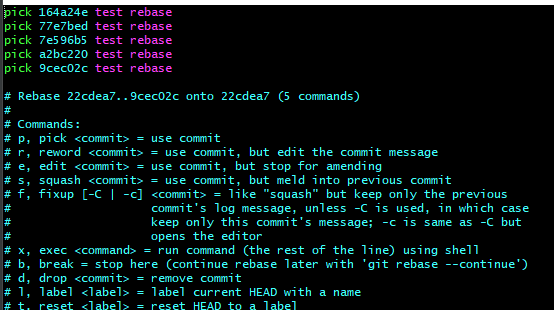
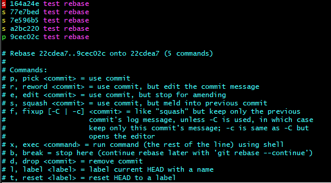
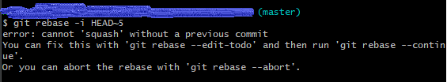
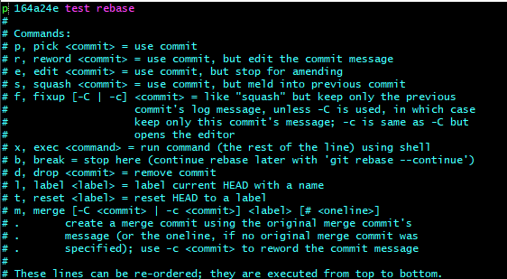

# git相关
## 配置 ssh 并查看本机私钥 / 公钥
### 配置 ssh 
- git config --global user.name 用户名: 配置账号;
- git config --global user.email 邮箱: 配置邮箱;
- ssh-keygen -t rsa -C "邮箱": 生成ssh;

### 查看本机私钥 / 公钥
- git bash;
- cd ~/.ssh: 进入 .ssh 目录;
- ls 查找 id_rsa.pub 文件;
- cat id_rsa.pub 或者 vim id_rsa.pub: 查看公钥;

## github.com 网站常用快捷键
- ?: 查看当前页支持的快捷键;
- T: 快速查找文件;
- L: 跳转到某一行;
- B: 查看文件提交记录;
- 。: 开启web编辑器;

## 常用命令
- git log: 查看提交记录;
- git show: 查看提交详情;
### 查看 git 安装位置
- where git: windows 查看 git 安装位置;
- which git: mac 查看 git 安装位置;

### 查看本地 / 远程分支情况
- git branch: 列出所有本地分支;
- git branch -r: 列出所有远程分支;
- git branch -a: 列出所有本地分支 + 远程分支;
- git remote show origin: 查看远程分支状态;
- git remote prune origin: 删除本地依旧显示, 但远程已删除的分支;
- git checkout -b XXX: 本地新建一个分支，并切换到该分支;
- git push: 将当前分支推送至远程同名分支;
- git push origin XXX: 将代码修改/新建的分支提交到远程 XXX 分支;
- git push origin XXX --force: 将更改强制推送;

### git stash 常用命令
+ git stash list: 查看储藏栈;
+ git stash: 等同于"git stash push", 将未完成的修改保存到一个栈上;
+ git stash push -m 'name': 保存的同时, 对 stash 添加描述;
+ git stash apply 名字: 恢复指定的储藏，如果不指定储藏，默认最近的储藏;
+ git stash drop 名字: 可以移除指定的储藏;
+ git stash pop: 恢复储藏然后立即从栈上扔掉它;

### 将本地项目上传到 github 上
1. 本地项目 git init 
2. github 上创建对应的新项目，并复制项目地址
3. 本地项目执行 git remote add origin XXX.git(github 上新建的项目地址)  
如果出现 fatal: remote origin already exists,  
执行 git remote rm origin 删除远程仓库
4. git push origin master 上传到指定分支

### 与远程分支同步
+ git fetch origin
+ git rebase origin/develop

### 文件修改/删除后, 先执行 add, 然后执行 commit
- git add <filename>: 将特定的 file 从工作区添加到暂存区, 告诉 Git 下次哪些变化需要保存到仓库区;
- git add . : 当前目录下所有变化的文件, 放入暂存区;
- git commit <filename> -m "message": 将暂存区中的变化提交到仓库区。

### git rebase 流程
+ 查看本地commit记录: git log / git show 
+ 合并之前的commit, 4 表示最近的 4 次: git rebase -i HEAD~4 
+ 
+ 
+ :wq 保存并退出
+ 遇到错误提示:
+ 
+ 输入 git rebase --edit-todo 进行修改:
+ 
+ :wq 保存并退出
+ 执行 git rebase --continue
+ 完成 rebase 操作, 通过 git log 查看
+ 强制提交到远程分支: git push origin master --force
#### 撤销 rebase:
+ 查看记录: git reflog 
+ 完成撤销操作: git reset --hard HEAD@{XXX}

### 修改密码后, git pull / push 报错 [fatal: Authentication failed for]
+ windows 控制面板 -> 用户账户 -> 凭据管理器 -> windows凭据
+ 修改 git 网址对应的账号密码
