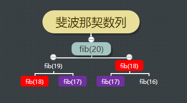
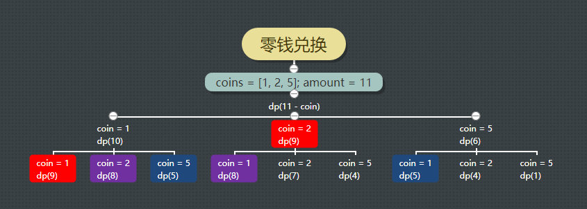

# 动态规划(Dynamic Programming, DP)
- 解决求[最长子序列, 最小编辑距离, 背包问题等](https://labuladong.github.io/algo/di-er-zhan-a01c6/dong-tai-g-a223e/dong-tai-g-1e688/)。
- 将原问题分解成若干子问题进行求解, 记录子问题的解, 避免重复计算。
- 求解方法: 穷举, 找最值;
- 动态规划三要素: 重叠子问题, 最优子结构, 状态转移方程;
- 判断算法问题是否具备 最优子结构, 是否能通过子问题的最值得到原问题的最值;
- 只有列出正确的 状态转移方程, 才能正确的枚举;
- 暴力枚举效率低, 需要使用 备忘录 或 DP table 优化穷举过程, 避免不必要的计算。
```
# 自顶向下递归的动态规划:
def dp(状态1, 状态2, ...):
  for 选择 in 所有可能的选择:
    # 此时的状态已经因为做了选择而改变
    result = 求最值(result, dp(状态1, 状态2, ...))
  return result

# 自底向上迭代的动态规划:
# 初始化 base case
dp[0][0][...] = base case
# 进行状态转移
for 状态1 in 状态1的所有取值:
  for 状态2 in 状态2的所有取值:
    for ...
      dp[状态1][状态2][...] = 求最值(选择1，选择2...)
```

## 重叠子问题: 存在重复计算的问题
### 例: 斐波那契数列
- F(0) = 0, F(1) = 1, F(n) = F(n - 1) + F(n - 2), 其中 n > 1, 给定 n 计算 F(n);
```javascript
function fib(n) {
  if (n === 0) return 0;
  if (n === 1) return 1;
  
  return fib(n - 1) + fib(n - 2);
}
```
- 遇到递归问题, 可以画出递归树, 分析算法复杂度;
- 画出递归树后, 可以看出上述代码存在重复计算的问题, fib(18) 重复计算:


### 例: 重叠子问题, 解决方法
- 使用备忘录记录;
```javascript
function fib(n) {
  const memo = [];
  
  dp(n, memo);
}

function dp(n, memo) {
  if (n === 0) return 0;
  if (n === 1) return 1;

  if (memo[n]) return memo[n];

  memo[n] = dp(n - 1, memo) + dp(n - 2, memo);
  
  return memo[n];
}
```

### 自底向上的递归求解
- 上述方法是自顶向下进行递归求解: fib(20) 向下逐渐分解, 直到 fib(0), fib(1) 两个 base case, 然后逐层返回;
- 自底向上: 从最底端、最简单、问题规模最小、已知结果的 fib(0), fib(1) 两个 base case 开始往上推, 直到 fib(20);
- 这就是递推的思路, 也是动态规划一般都脱离递归, 而是由循环迭代完成计算的原因。
- 使用备忘录进行记录:
```javascript
function fib(n) {
  const memo = [];

  memo[0] = 0;
  memo[1] = 1;

  for (let i = 2; i <= n; i++) {
    memo[i] = memo[i - 1] + memo[i - 2];
  }

  return memo[n];
}
```

## 状态转移方程: 根据已知状态推出新的状态
- 确定 base case;
- 状态: 原问题和子问题中会变化的变量;
- 选择: 导致状态发生变化的行为;
- 确定 dp 函数/数组的定义。
- 动态规划最困难的就是写出暴力解, 即状态转移方程;
- 上述斐波那契数列的状态转移方程:  

- 根据状态转移方程, 不需要使用数组, 只需要存储之前的两个状态即可:
```javascript
function fib(n) {
  if (n === 0) return 0;
  if (n === 1) return 1;

  let dp1 = 1, dp2 = 0;
  let dp;

  for (let i = 2; i <= n; i++) {
    dp = dp1 + dp2;
    dp2 = dp1;
    dp1 = dp;
  }
  
  return dp;
}
```

### 例: 零钱兑换问题
- 一个整数数组 coins 表示不同面额的硬币; 一个整数 amount 表示总金额。  
计算并返回可以凑成总金额所需的 最少的硬币个数, 如果没有任何一种硬币组合能组成总金额, 返回 -1。  
每种硬币的数量是无限的。
- 具有最优子结构, 子问题间相互独立, 是动态规划问题。

#### 状态转移方程:


- 暴力求解:
```javascript
function coinChange(coins, amount) {
  return dp(coins, amount);
}

function dp(coins, amount) {
  if (amount === 0) return 0;
  if (amount < 0) return -1;
  
  let res = Infinity;
  
  for (let coin of coins) {
    const subProblem = dp(coins, amount - coin);

    if (subProblem < 0) continue;
  
    res = Math.min(res, subProblem + 1);
  }

  return res === Infinity ? -1 : res;
}
```

- 优化, 画出递归树(coins = [1, 2, 5], amount = 11):

```javascript
function coinChange(coins, amount) {
  const memo = [];
  const dp = function (coins, amount) {
    if (amount === 0) return 0;
    if (amount < 0) return -1;
    
    if (memo[amount]) return memo[amount];
    
    let res = Infinity;
    
    for (let coin of coins) {
      const subProblem = dp(coins, amount - coin);
        
      if (subProblem < 0) continue;
        
      res = Math.min(res, subProblem + 1);
    }
    
    memo[amount] = (res === Infinity) ? -1 : res;
    
    return memo[amount];
  };

  return dp(coins, amount);
}
```
